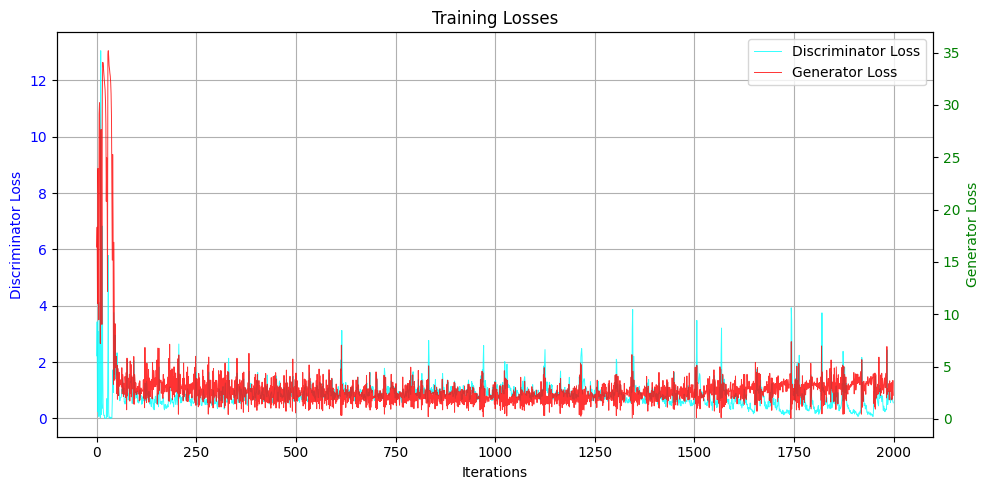
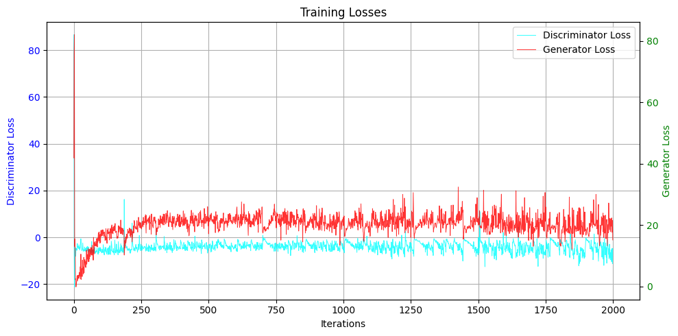
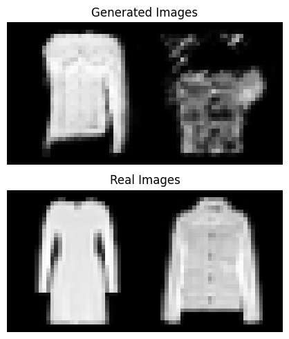
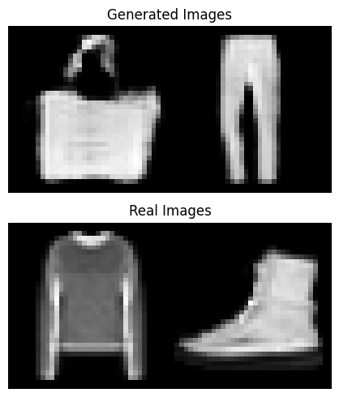

# gp_wgan
Implementing a section of the paper "Improved Training of Wasserstein GANs" by Gulrajani et al. Specifically, we will implement the architecture designed for CIFAR-10 (the simpler version without residual layers, described in Section F). Appropriate modifications will be made for the Fashion MNIST dataset.

## Introduction
Generative Adversarial Networks (GANs) have proven highly effective at creating realistic data samples. Drawing inspiration from the paper "Improved Training of GANs," this project aims to refine GAN training methodologies by integrating advanced optimization strategies. The study evaluates the performance of two popular GAN frameworks: Deep Convolutional GAN (DCGAN) and Wasserstein GAN with Gradient Penalty (WGAN-GP).

## Training
To preform proper training, one should collect the data using "Data collection" Section, run the model defenition using the "Model defenition" section, and train the data using "Training" section. The model will be saved locally in `saved_models`.

### Loss Plot
Presented below are the loss plots for both DCGAN and WGAN-GP:

**DCGAN Plot:**

**WGAN-GP Plot:**

## Generation and Evaluation
If no saved models are available, train a GAN as described in the previous section.

To evaluate, execute all cells in the Evaluation section. Note that each execution of the evaluation cell will generate different samples.

Additionally, we provide sample outputs from each model, which can be reproduced in the Evaluation section:

**DCGAN Generated Samples:**

**WGAN-GP Generated Samples:**

## References
1. **Unsupervised Representation Learning with Deep Convolutional Generative Adversarial Networks.** (2015). [REF](https://arxiv.org/abs/1511.06434)
2. **Wasserstein GAN.** (2017). [REF](https://arxiv.org/abs/1701.07875)
3. **Improved Training of Wasserstein GANs.** (2017). [REF](https://arxiv.org/abs/1704.00028)
